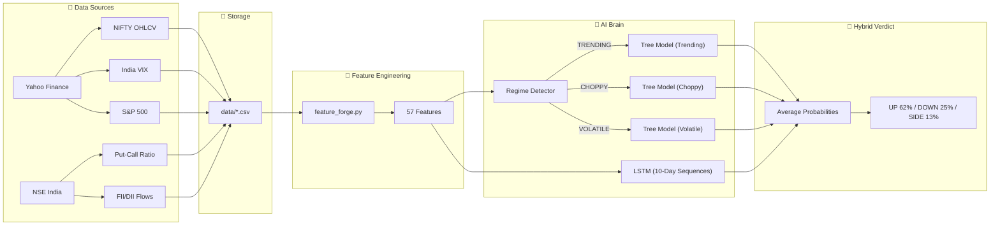
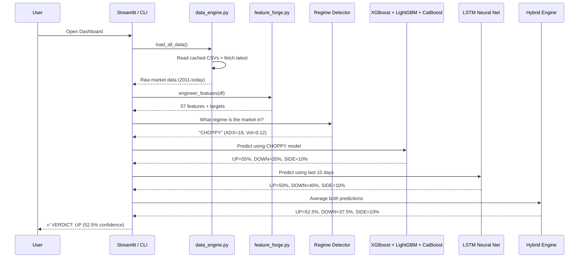
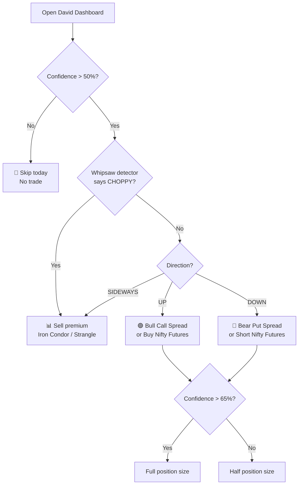
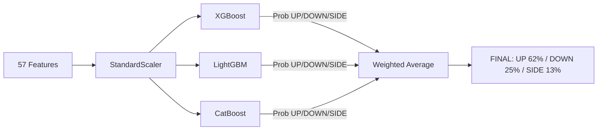
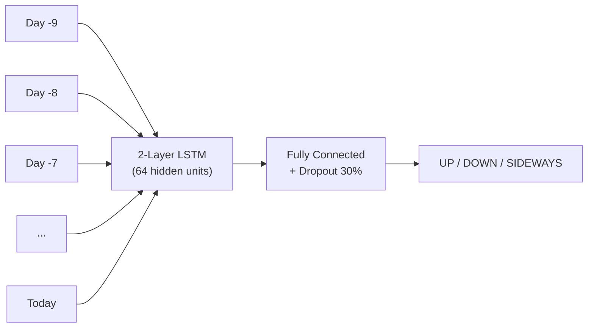
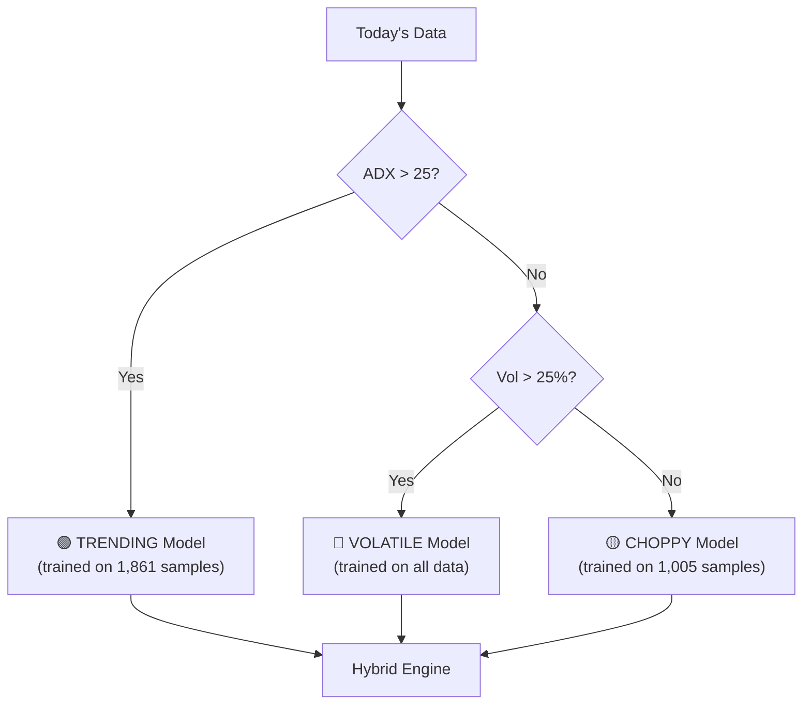
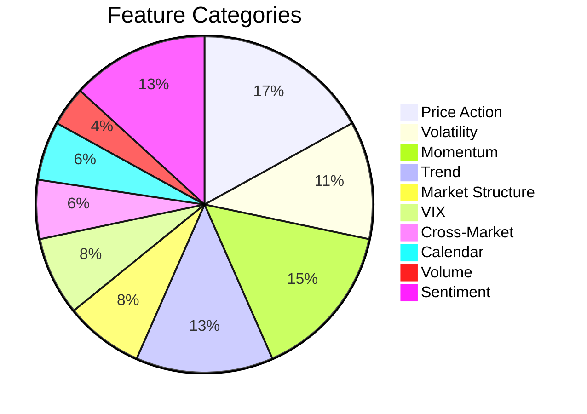

# 🦅 DAVID PROPHETIC ORACLE v2.0

> **AI-Powered Nifty Direction Prediction Engine for Retail Traders**
>
> Hybrid Architecture: XGBoost + LightGBM + CatBoost + LSTM + Regime Detection
> Tested Accuracy: **62-66%** across 1-year out-of-sample backtest.

---

## What Does David Do?

David answers ONE question every day: **"Where is Nifty going tomorrow?"**

| Feature | What You Get |
|:---|:---|
| **Direction Prediction** | UP / DOWN / SIDEWAYS with hybrid AI confidence % |
| **Regime Detection** | Is the market Trending, Choppy, or Volatile? |
| **7/30-Day Range** | Expected price bands with 80% and 50% confidence |
| **Support & Resistance** | Real S/R from historical fractal detection |
| **Whipsaw Detector** | Is the market choppy? Should you skip today? |
| **Iron Condor Analyzer** | "Will Nifty breach my strike at 25600?" |
| **Trade Recommendation** | Bull Spread / Bear Spread / Iron Condor with exact strikes |
| **Market Sentiment** | Live PCR, FII/DII institutional flows |

---

## Quick Start

```bash
# 1. Install dependencies
pip install -r requirements.txt

# 2. Pre-train models (one-time, ~2 minutes)
python train_models.py

# 3. Launch the dashboard (instant load!)
streamlit run david_streamlit.py

# OR use the CLI
python david_oracle.py
```

---

## How It Works — Complete Architecture

### End-to-End Data Flow



### How the Prediction Works (Step by Step)



---

## 📈 How to Use David for Trading — A Complete Guide

### Step 1: Check the Verdict

When you open the dashboard, the first thing you see is the **Verdict**:
- **Direction**: UP, DOWN, or SIDEWAYS
- **Confidence**: 0-100%

### Step 2: Check Signal Quality

| Confidence | Action | Position Size |
|:---|:---|:---|
| **> 65%** | ⭐ High conviction — take the trade | Full position |
| **50-65%** | ◆ Moderate — trade with caution | Half position |
| **< 50%** | ○ Low conviction — skip this day | No trade |

### Step 3: Read the Regime

| Regime | What It Means | Trading Style |
|:---|:---|:---|
| 🟢 **TRENDING** (ADX > 25) | Strong directional move | Follow the signal, trail your stop |
| 🟡 **CHOPPY** (low ADX, low vol) | Sideways grind | Trade iron condors, sell premium |
| 🔴 **VOLATILE** (vol > 25%) | Wild swings | Widen stops, reduce size |

### Step 4: Check Whipsaw Status

If the Whipsaw detector says **⚠️ CHOPPY**, the market is likely to fake-out and reverse. In this case:
- Don't chase breakouts
- Use wider stop-losses
- Consider iron condor / strangle strategies instead

### Step 5: Use Support & Resistance

The S/R levels tell you where Nifty is likely to bounce or stall:
- **Buy near Support** (price floor)  
- **Sell near Resistance** (price ceiling)
- S/R levels with **more touches** and a **higher strength score** are more reliable

### Decision Flowchart



### Example Trade Flow

```
📅 Monday Morning: Open David
   ├── Verdict: UP (61%)
   ├── Regime: TRENDING (ADX: 28)
   ├── Whipsaw: ✅ TRENDING (not choppy)
   ├── Support: 24,200  |  Resistance: 24,850
   └── PCR: 1.12 (put-heavy = bullish contrarian)

💡 Decision:
   → Direction: UP, moderate confidence
   → Regime: TRENDING → follow the signal
   → Not choppy → safe to trade directionally
   → Action: BUY Nifty 24500 CE, half position
   → Stop-loss: Below support at 24,200
   → Target: Near resistance at 24,850
```

---

## Model Deep Dive

### 1. Ensemble Direction Classifier

Three gradient-boosted classifiers vote on direction:



**Target**: Predict if Nifty's **next-day return** will be positive (UP), negative (DOWN), or flat (SIDEWAYS ±0.3%).

### 2. LSTM Sequence Model

Unlike trees which look at each day independently, the LSTM sees **10 consecutive days** as a pattern:



### 3. Regime-Specific Routing

Instead of one model for all markets, David detects the "season" and routes to the right specialist:



---

## The 57 Features



| Category | Features | Purpose |
|:---|:---|:---|
| **Price Action** | returns (1/5/10/20d), log return, gap%, body ratio, wicks | Raw price behavior |
| **Volatility** | realized vol 10/20d, vol-of-vol, ATR, BB width, BB position | How much is market moving? |
| **Momentum** | RSI (7/14), MACD, Stochastic, Williams %R, ROC | Is momentum fading? |
| **Trend** | SMA distances (20/50/200), SMA cross, ADX | Is there a trend? |
| **Market Structure** | Higher-high/lower-low counts, streak, 52w distance | Structural breaks |
| **VIX** | VIX ratio, VIX percentile, VIX change | Fear/greed gauge |
| **Cross-Market** | S&P return, S&P correlation, S&P lag | Global context |
| **Calendar** | Day of week, month, expiry proximity | Seasonal patterns |
| **Sentiment** | PCR, PCR SMA, FII/DII net flow, institutional trend | Smart money tracking |

---

## Automation — GitHub Actions

David runs on autopilot via GitHub Actions:

| Schedule | What Happens |
|:---|:---|
| **Every 15 mins** (Mon-Fri, 8:45 AM - 4 PM IST) | Sync latest market data from Yahoo + NSE |
| **Daily at 4:30 PM IST** (post-market close) | Full model retrain on latest data |
| **Manual trigger** | Click "Run Workflow" to force sync + retrain |

Models are saved as `.pkl` files and committed to the repo, so when you open Streamlit, it loads **instantly** (no training wait).

---

## Accuracy Track Record

Tested over 1 year (Mar 2025 — Mar 2026) on completely out-of-sample data:

| Configuration | Accuracy | Signals |
|:---|:---:|:---:|
| ❌ Old Baseline (5-day horizon) | 51.5% | 200 |
| ✅ 1-Day Horizon | 65.1% | 109 |
| ✅ 1-Day + Regime Models | 66.0% | 47 |
| ✅ Hybrid (Trees + LSTM) | 64.7% | 17 |

---

## File Structure

```
David-ML/
├── david_streamlit.py           # 🌐 Streamlit Dashboard (run this!)
├── david_oracle.py              # 💻 CLI Interface
├── data_engine.py               # 📡 Data fetching + caching
├── feature_forge.py             # 🧪 Feature engineering (57 features)
├── train_models.py              # 🏋️ Pre-train all models (for CI/CD)
├── utils.py                     # 🔧 Constants, colors, formatters
├── requirements.txt             # 📦 Dependencies
├── models/
│   ├── ensemble_classifier.py   # XGBoost + LightGBM + CatBoost
│   ├── lstm_classifier.py       # PyTorch LSTM (10-day sequences)
│   ├── regime_detector.py       # 5-state HMM
│   ├── range_predictor.py       # Quantile regression
│   └── sr_engine.py             # Fractal S/R engine
├── analyzers/
│   ├── whipsaw_detector.py      # Chop/trend detector
│   ├── iron_condor_analyzer.py  # Strike touch probability
│   └── bounce_analyzer.py       # Recovery probability
├── data/                        # Cached CSVs (auto-synced)
├── saved_models/                # Pre-trained .pkl files
└── .github/workflows/
    └── data_sync.yml            # GitHub Actions automation
```

---

## Honesty Note

> [!IMPORTANT]
> **No AI can predict markets with 100% accuracy.** Financial markets contain irreducible randomness. What David provides is:
> - A **statistically significant edge** over random guessing (62-66% vs 50%)
> - **Honest probability estimates** so you know WHEN to skip uncertain trades
> - **Risk management tools** (whipsaw detection, regime awareness) to protect capital
>
> Combined with proper position sizing (half position on moderate confidence, full on high), this edge can generate consistent returns over time.

> [!CAUTION]
> **Always paper trade first.** Never deploy real capital without at least 1 month of paper trading to understand David's behavior in different market conditions. Past performance does not guarantee future results.

---

## License

Internal use only. Research tool for educational purposes.

> **Disclaimer**: This software is for educational and research purposes only. The authors are not responsible for any financial losses incurred from using this system. Always consult a qualified financial advisor before making investment decisions.
